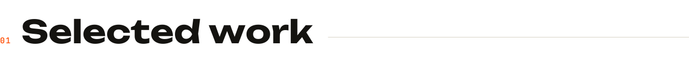
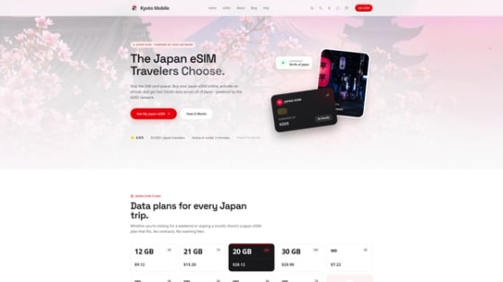
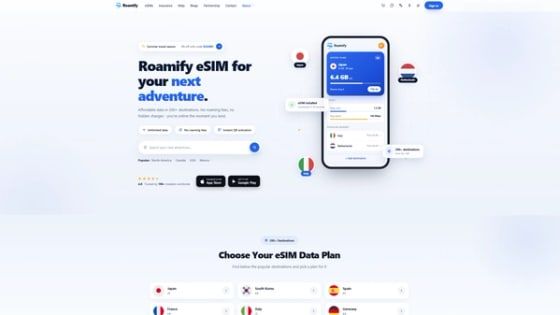
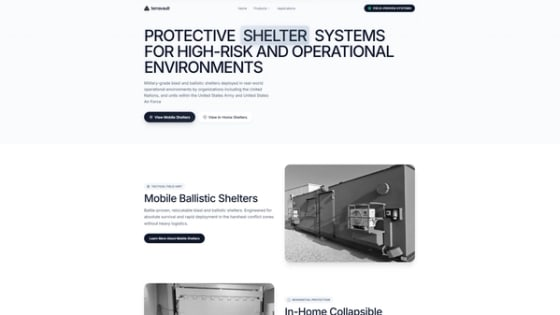
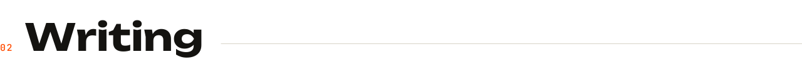
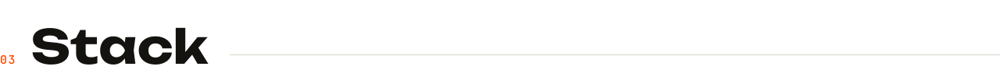
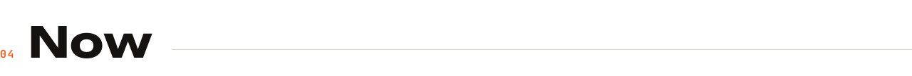
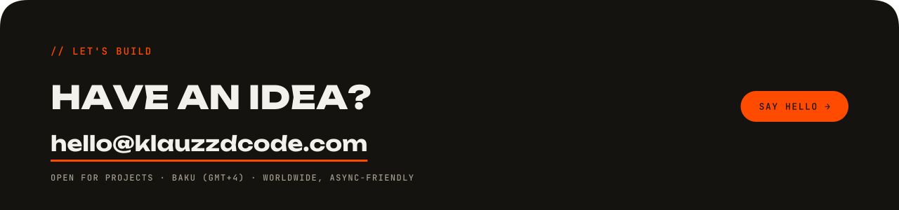

<a href="https://klauzzdcode.com">
  <picture>
    <source media="(prefers-color-scheme: dark)" srcset="assets/banner-dark.svg">
    
  </picture>
</a>

  
  
  
  
  

# Ogtay Iskandarov

**[klauzzdcode](https://klauzzdcode.com) is my one-person design-engineering studio in Baku.** I take web products from Figma to production on my own: UI/UX, frontend, backend, AI features, SEO and Generative Engine Optimization. Since 2025 I am chief designer and full-stack developer at Roamify, building a production eSIM platform end to end. Freelance since 2023 for clients across Russia, Kazakhstan, Kyrgyzstan, Ukraine and the UK.

> The person who reads your brief is the person who writes the code and ships it. No handoff, nothing lost in translation.

`brief → figma → build → ship` · fixed scope or retainer, always with a deploy at the end

## <picture><source media="(prefers-color-scheme: dark)" srcset="assets/hdr-work-dark.svg"></picture>

<table>
<tr>
<td width="33%" valign="top">

  
<code>E-COMMERCE</code> <code>NEXT.JS</code> <code>NESTJS</code>
  
<b><a href="https://klauzzdcode.com/en/projects/kyoto-mobile-esim-platform">Kyoto Mobile</a></b>
 
Multilingual Japan travel eSIM storefront. Plan comparison, Stripe checkout, built end to end.
</td>
<td width="33%" valign="top">

  
<code>SEO</code> <code>GEO</code> <code>SCHEMA</code>
  
<b><a href="https://klauzzdcode.com/en/projects/roamify-esim-seo-geo">Roamify</a></b>
 
Technical SEO and Generative Engine Optimization on a production eSIM platform. Routing, structured data, programmatic pages.
</td>
<td width="33%" valign="top">

  
<code>MARKETING SITE</code> <code>HAND-CODED</code>
  
<b><a href="https://klauzzdcode.com/en/projects/terravault-marketing-site">Terravault</a></b>
 
Marketing site for a military-grade shelter manufacturer. Briefed and live in two days.
</td>
</tr>
</table>

// every one designed, coded and deployed by the same pair of hands · [all projects →](https://klauzzdcode.com/en/projects)

## <picture><source media="(prefers-color-scheme: dark)" srcset="assets/hdr-writing-dark.svg"></picture>

Notes on design systems, Next.js, SEO/GEO and AI-assisted workflows - what survives contact with production.

- **[Claude Code + Obsidian without the flat log](https://klauzzdcode.com/en/blogs/claude-code-obsidian-mcp-notes)** - connecting Claude Code to Obsidian over MCP, and the four-part note template that replaced a 407-line work log.

[all posts →](https://klauzzdcode.com/en/blogs)

## <picture><source media="(prefers-color-scheme: dark)" srcset="assets/hdr-stack-dark.svg"></picture>

<picture>
  <source media="(prefers-color-scheme: dark)" srcset="assets/stack-dark.svg">
  
</picture>

## <picture><source media="(prefers-color-scheme: dark)" srcset="assets/hdr-now-dark.svg"></picture>

- Building a production eSIM platform at **Roamify** - design direction through to deploy.
- Learning **Convex**.
- Writing case studies and technical posts at [klauzzdcode.com/en/blogs](https://klauzzdcode.com/en/blogs).
- B.S. Computer Engineering, Azerbaijan Technical University · M.B.A. candidate, Baku Business University.
- Russian native · English and Turkish advanced · Azerbaijani · Japanese basic · French beginner.

 

[hello@klauzzdcode.com](mailto:hello@klauzzdcode.com) · [klauzzdcode.com](https://klauzzdcode.com) · [LinkedIn](https://www.linkedin.com/in/ogtay-iskandarov-a9b171230/)

