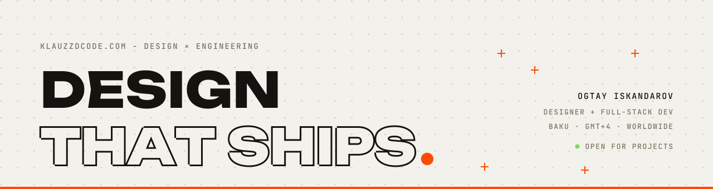

<a href="https://klauzzdcode.com">
  <picture>
    <source media="(prefers-color-scheme: dark)" srcset="assets/banner-dark.svg">
    
  </picture>
</a>

  
  
  
  
  

# Ogtay Iskandarov

**[klauzzdcode](https://klauzzdcode.com) is my one-person design-engineering studio in Baku.** I take web products from Figma to production on my own: UI/UX, frontend, backend, AI features, SEO and GEO. Since 2025 I am chief designer and full-stack developer at Roamify, building a production eSIM platform end to end. Freelance since 2023 for clients across Russia, Kazakhstan, Kyrgyzstan, Ukraine and the UK.

> The person who reads your brief is the person who writes the code and ships it. No handoff, nothing lost in translation.

`brief → figma → build → ship` · fixed scope or retainer, always with a deploy at the end

---

## `01` Selected work

<table>
<tr>
<td width="33%" valign="top">

  
<b><a href="https://klauzzdcode.com/en/projects/kyoto-mobile-esim-platform">Kyoto Mobile</a></b>
 
Multilingual Japan travel eSIM storefront. Plan comparison, Stripe checkout, Next.js and NestJS.
</td>
<td width="33%" valign="top">

  
<b><a href="https://klauzzdcode.com/en/projects/roamify-esim-seo-geo">Roamify - SEO &amp; GEO</a></b>
 
Technical SEO and Generative Engine Optimization on a production eSIM platform. Routing, structured data, programmatic pages.
</td>
<td width="33%" valign="top">

  
<b><a href="https://klauzzdcode.com/en/projects/terravault-marketing-site">Terravault</a></b>
 
Hand-coded marketing site for a military-grade shelter manufacturer. Live in two days.
</td>
</tr>
</table>

// every one designed, coded and deployed by the same pair of hands · [all projects →](https://klauzzdcode.com/en/projects)

## `02` Writing

Notes on design systems, Next.js, SEO/GEO and AI-assisted workflows - what survives contact with production.

- **[Claude Code + Obsidian without the flat log](https://klauzzdcode.com/en/blogs/claude-code-obsidian-mcp-notes)** - connecting Claude Code to Obsidian over MCP, and the four-part note template that replaced a 407-line work log.

[all posts →](https://klauzzdcode.com/en/blogs)

## `03` Stack

| | |
|---|---|
| **Design** | Figma · design systems · prototyping · identity and layout |
| **Frontend** | React · Next.js · TypeScript · Tailwind · SCSS/Less · PostCSS · shadcn/ui · Redux · Framer Motion · next-intl |
| **Backend** | Node.js · NestJS · Express · Prisma · REST APIs · NextAuth · Clerk · Passport · OAuth |
| **Data** | PostgreSQL · MySQL · MongoDB · Redis · Typesense |
| **Infra** | AWS · Vercel · Cloudinary · Stripe · Resend · Sanity · Git |
| **AI &amp; SEO** | LLM features · agents · prompt tooling · structured data · Core Web Vitals · GEO |
| **Also** | Web3.js and smart-contract integrations |

## `04` Now

- Building a production eSIM platform at **Roamify** - design direction through to deploy.
- Learning **Convex**.
- Writing case studies and technical posts at [klauzzdcode.com/en/blogs](https://klauzzdcode.com/en/blogs).
- B.S. Computer Engineering, Azerbaijan Technical University · M.B.A. candidate, Baku Business University.
- Russian native · English and Turkish advanced · Azerbaijani · Japanese basic · French beginner.

---

**Have an idea?** Describe the problem, not the service, and I will tell you honestly what it needs.

<a href="mailto:hello@klauzzdcode.com">hello@klauzzdcode.com</a> · <a href="https://klauzzdcode.com/en#contact">klauzzdcode.com</a>

// open for projects · Baku (GMT+4) · worldwide, async-friendly

